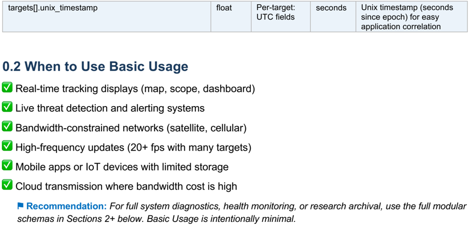
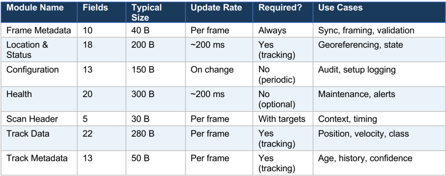

## RDXXB SERIES RADAR

## Modular JSON Output Schemas

## Categorized by Data Type · Mix &amp; Match · Pick What You Need

| Schema Version   | 1.0             |
|------------------|-----------------|
| Release Date     | 21 April 2026   |
| Total Categories | 8 (incl. Basic) |
| Total Modules    | 7               |

## 0. Basic Usage Schema (Quick Start)

For most applications, you only need location, target classification, and timestamps. This Basic Usage schema combines the essential fields into one compact JSON structure. Perfect for real-time tracking, display systems, and bandwidth-constrained networks.

## Includes: Radar GPS + Orientation | Target ID + Classification + Signals + Position + Velocity | UTC Timestamp

Size: ~200 bytes per target | Bandwidth: ~2 KB per target per frame | Update: Per pulse group

```
{ "radar_location": { "gps": { "longitude": 107.608234, "latitude": -6.897456, "elevation_m": 150.0 }, "orientation": { "roll_angle_deg": 0.5, "pitch_angle_deg": 1.2, "north_correction_angle_deg": 8.5 } }, "targets": [ { "track_id": 1042, "track_delete_flag": "0x00", "track_status": "active", "track_type_code": "0x20", "track_type_label": "drone", "confidence": 0.87, "energy": 2847.43, "credit_ratio": 0.92, "distance_m": 1243.7, "azimuth_deg": 142.3, "elevation_pitch_deg": 7.2, "height_m": 155.8, "radial_speed_ms": -3.4, "longitude": 107.612483, "latitude": -6.903124, "altitude_m": 156.0, "vx_east_ms": -2.1, "vy_north_ms": -2.7, "vz_up_ms": 0.3, "unix_timestamp": 1766049291.82 }, { "track_id": 1051, "track_delete_flag": "0x00", "track_status": "active", "track_type_code": "0x20", "track_type_label": "drone", "confidence": 0.74, "energy": 1921.05, "credit_ratio": 0.78, "distance_m": 2781.2, "azimuth_deg": 138.7, "elevation_pitch_deg": 3.9, "height_m": 189.4, "radial_speed_ms": 5.1, "longitude": 107.635817, "latitude": -6.921089, "altitude_m": 190.0, "vx_east_ms": 4.2, "vy_north_ms": 2.8, "vz_up_ms": -0.6, "unix_timestamp": 1766049291.82
```

}

]

}

## 0.1 Basic Usage Field Reference

Quick reference for all fields in the Basic Usage schema. Each field maps back to the protocol.

| Field                                                 | Type    | Source                   | Units           | Purpose                                                              |
|-------------------------------------------------------|---------|--------------------------|-----------------|----------------------------------------------------------------------|
| radar_location.gps.longitude                          | float   | Status frame             | deg WGS-84      | Radar installation longitude (6 decimals)                            |
| radar_location.gps.latitude                           | float   | Status frame             | deg WGS-84      | Radar installation latitude (6 decimals)                             |
| radar_location.gps.elevation_m                        | float   | Status frame             | meters          | Radar antenna elevation above sea level                              |
| radar_location.orientation.roll_angle_deg             | float   | Status frame             | degrees         | Roll angle (inclinometer X- axis)                                    |
| radar_location.orientation.pitch_angle_deg            | float   | Status frame             | degrees         | Pitch angle (inclinometer Y- axis)                                   |
| radar_location.orientation.north_correction_angle_deg | float   | Status frame             | degrees [0,360] | North correction calculated by radar                                 |
| targets[].track_id                                    | integer | Per-target field         | ID              | Persistent track identifier                                          |
| targets[].track_delete_flag                           | hex     | Per-target field         | flag            | 0x00=active, 0x01=deleted                                            |
| targets[].track_status                                | string  | Derived                  | -               | Human-readable: 'active' or 'deleted'                                |
| targets[].track_type_code                             | hex     | Per-target: track_type   | -               | 0x20=drone, 0x11=person, 0x12=car, etc.                              |
| targets[].track_type_label                            | string  | Derived                  | -               | Human-readable class: drone, person, car, bird, vessel, other, false |
| targets[].confidence                                  | float   | Per-target: confidence   | ratio [0,1]     | Autonomous ID confidence (precision 0.01). 0.87 = 87%                |
| targets[].energy                                      | float   | Per-target: energy       | dB/linear       | Received signal strength                                             |
| targets[].credit_ratio                                | float   | Per-target: credit_ratio | ratio [0,1]     | Track quality score                                                  |
| targets[].distance_m                                  | float   | Per-target: distance     | meters          | Slant range from radar to target                                     |
| targets[].azimuth_deg                                 | float   | Per-target: azimuth      | degrees [0,360] | Compass bearing to target                                            |
| targets[].elevation_pitch_deg                         | float   | Per-target: pitch        | degrees         | Elevation angle (negative=below horizon)                             |
| targets[].height_m                                    | float   | Per-target: height       | meters          | Height above reference datum                                         |
| targets[].radial_speed_ms                             | float   | Per-target: speed        | m/s             | Doppler velocity along bore-sight (negative=approaching)             |
| targets[].longitude                                   | float   | Per-target: longitude    | deg WGS-84      | Target longitude (6 decimals)                                        |
| targets[].latitude                                    | float   | Per-target: latitude     | deg WGS-84      | Target latitude (6 decimals)                                         |
| targets[].altitude_m                                  | float   | Per-target: altitude_gps | meters WGS-84   | Target GPS altitude                                                  |
| targets[].vx_east_ms                                  | float   | Per-target: vx           | m/s             | Velocity East (ENU frame)                                            |
| targets[].vy_north_ms                                 | float   | Per-target: vy           | m/s             | Velocity North (ENU frame)                                           |
| targets[].vz_up_ms                                    | float   | Per-target: vz           | m/s             | Velocity Up (ENU frame, positive=ascending)                          |

| targets[].unix_timestamp   | float   | Per-target: UTC fields   | seconds   | Unix timestamp (seconds since epoch) for easy application correlation   |
|----------------------------|---------|--------------------------|-----------|-------------------------------------------------------------------------|



## 1. Modular JSON Schema Overview

Beyond Basic Usage, the RDXXB radar outputs 75+ fields across multiple data categories. This section presents the complete data organized into 7 independent JSON modules. You can transmit, store, or process each module independently based on your application needs.

## Data Categories (Advanced)

1. Frame Metadata - Protocol wrapper &amp; sync info
2. Radar Location &amp; Status - GPS, orientation, operational state
3. Radar Configuration - Filters, frequency, silent zones, auto-ID
4. Radar Health - Power, thermals, system status, firmware
5. Scan Header - Current sweep parameters
6. Track Data - Per-target measurements (classification, position, velocity)
7. Track Metadata - Age, history, confidence tracking

## Use Cases (Advanced)

Use each module independently:

- Minimal tracking-only: Frame + Scan + Tracks
- Health monitoring: Frame + Location + Health
- Full telemetry: All modules combined
- Archive low-bandwidth: Frame + Location + Scan + Tracks (skip Health/Config)

## 2. Module Schemas with Examples (Advanced)

## 2.1 Module: Frame Metadata

Protocol wrapper and frame synchronization.

```
Use when: Always. Required for every transmission. Bandwidth: ~40 bytes. { "frame_metadata": { "frame_header": "0x55AA", "frame_id": "0xFF02", "frame_type": "search_target_information", "frame_count": 84231, "frame_timestamp_utc": "2025-12-17T08:34:51.820Z", "protocol_id": 1, "protocol_device": "RD01", "protocol_major_version": 2, "protocol_minor_version": 14, "checksum_valid": true } }
```

## 2.2 Module: Radar Location &amp; Status

GPS position, orientation, and operational state of the radar device.

Use when: Always tracking. Essential for georeferencing targets.

```
Bandwidth: ~200 bytes. { "radar_device": { "device_id": 1, "device_label": "Front-End Radar 1", "model_name": "RD01", "network": { "ip_address": "192.168.1.3", "port": 7000 }, "gps": { "longitude": 107.608234, "latitude": -6.897456, "elevation_m": 150.0, "heading_angle_deg": 45.0, "heading_valid": true, "satellite_count": 12, "installed_location_name": "Bandung, West Java" }, "orientation": { "roll_angle_deg": 0.5, "pitch_angle_deg": 1.2, "north_correction_angle_deg": 8.5 }, "operational_state": { "work_mode": "0x11", "work_mode_label": "search", "fault_type": "0x00", "fault_label": "none", "servo_mode": "0x33", "servo_mode_label": "circular_scan",
```

```
"scan_mode": "0x01", "scan_mode_label": "mechanical_scanning" }, "servo": { "current_azimuth_deg": 142.3, "current_pitch_deg": 5.1, "current_scan_cycle": 47 }, "frequency": { "current_code": 10, "current_x_band_ghz": 9.5, "current_ku_band_ghz": 16.2 } } }
```

## 2.3 Module: Radar Configuration

Detection filters, silent zones, and autonomous identification settings.

Use when: System setup, periodic audit, or configuration logging.

Bandwidth: ~150 bytes.

```
{ "radar_configuration": { "silent_zones": [ { "zone_number": 1, "start_angle_deg": 180.0, "end_angle_deg": 200.0, "enabled": true }, { "zone_number": 2, "start_angle_deg": 0.0, "end_angle_deg": 0.0, "enabled": false } ], "filters": { "height_min_near_zone_m": 50, "height_min_far_zone_m": 100, "height_max_m": 600, "speed_min_ms": 0.0, "speed_max_ms": 60.0, "range_min_m": 200, "range_max_m": 7500, "altitude_range_km": 7.5 }, "autonomous_identification": { "enabled": true, "max_targets": 2 } } }
```

## 2.4 Module: Radar Health

Power consumption, temperatures, system status, firmware versions.

Use when: Health monitoring, diagnostics, predictive maintenance.

Bandwidth: ~300 bytes.

```
{ "radar_health": { "thermals": { "subarray_temperatures": [ { "index": 1, "temperature_c": 45 }, { "index": 2, "temperature_c": 44 }, { "index": 3, "temperature_c": 46 }, { "index": 4, "temperature_c": 45 }, { "index": 5, "wave_controller_version": "1.2" } ], "signal_board_temperature_c": 52, "frequency_synthesizer_temperature_c": 48.5 }, "power": { "subarray_currents": [ { "index": 1, "current_a": 5.4 }, { "index": 2, "current_a": 5.3 }, { "index": 3, "current_a": 5.5 }, { "index": 4, "current_a": 5.4 } ], "signal_voltages": [ { "channel": 1, "voltage_v": 12 }, { "channel": 2, "voltage_v": 5 }, { "channel": 3, "voltage_v": 3.3 } ] }, "system_health": { "fan_status": { "fan1": "normal", "fan2": "normal", "fan3": "normal", "fan4": "normal" }, "memory_status": { "qdr_initialized": true, "ddr_0_initialized": true, "ddr_1_initialized": true, "pcie_link_ok": true } }, "firmware": { "fpga_version": "v3.21", "data_processing_version": "2.14.05.2025" } } }
```

## 2.5 Module: Scan Header

Current sweep parameters and pulse group metadata.

Use when: Always with target data. Provides timing and scan context. Bandwidth: ~30 bytes.

```
{ "scan_header": { "search_azimuth_deg": 142.3, "search_elevation_deg": 5.1, "scan_cycle_count": 47, "pulse_group_id": 113842, "target_count": 2 } }
```

## 2.6 Module: Track Data (Per Target)

Classification, position, velocity, and signal quality for each detected target.

Use when: Always transmit with tracking systems. One record per target.

Bandwidth: ~280 bytes per target.

```
{ "track": { "track_identification": { "track_id": 1042, "track_delete_flag": "0x00", "track_status": "active" }, "classification": { "track_type_code": "0x20", "track_type_label": "drone", "confidence": 0.87, "confidence_pct": "87%" }, "signal_quality": { "energy": 2847.43, "credit_ratio": 0.92, "credit_ratio_pct": "92%" }, "polar_coordinates": { "distance_m": 1243.7, "azimuth_deg": 142.3, "elevation_pitch_deg": 7.2, "height_m": 155.8, "radial_speed_ms": -3.4, "radial_speed_label": "approaching" }, "geodetic_coordinates": { "longitude": 107.612483, "latitude": -6.903124, "altitude_m": 156.0, "distance_from_radar_m": 1243.7, "bearing_from_radar_deg": 142.3, "altitude_above_radar_m": 6.0 }, "velocity_enu": { "vx_east_ms": -2.1, "vy_north_ms": -2.7, "vz_up_ms": 0.3, "total_speed_ms": 3.42, "horizontal_speed_ms": 3.41, "vertical_direction": "ascending" } } }
```

## 2.7 Module: Track Metadata (Per Target)

## Track age, history, confidence, and loss indicators.

Use when: Track management, filtering, prediction algorithms.

```
Bandwidth: ~50 bytes per target. { "track_metadata": { "track_id": 1042, "loss_count_cpi": 0, "loss_reason_code": 0, "update_time_cpi": 113842, "age_pulses": 0, "radar_frontend_id": 1, "track_history": { "track_point_count": 38, "envelope_point_count": 6, "track_age_pulses": 38 }, "utc_timestamp": { "year": 2025, "month": 12, "day": 17, "hour": 8, "minute": 34, "second": 51, "millisecond": 820, "iso8601": "2025-12-17T08:34:51.820Z", "unix_timestamp": 1766049291.82 } } }
```

## 3. Message Composition Examples (Advanced)

Combine modules to create messages tailored to your use case. Examples below show different transmission profiles.

## 3.1 Minimal Tracking (20 KB/s for 50 targets)

Include: Frame Metadata + Radar Location + Scan Header + Track Data + Track Metadata Exclude: Health, Configuration

Best for: High-frequency tracking streams, bandwidth-constrained networks, real-time tracking displays.

```
{ "frame_metadata": { ... }, "radar_device": { "device_id": 1, "gps": { ... }, "operational_state": { ... } }, "scan_header": { ... }, "targets": [ { "track_id": 1042, "track": { ... }, "track_metadata": { ... } }, { ... more targets ... } ] }
```

## 3.2 Full Telemetry (50 KB/s for 50 targets)

Include: All 7 modules

Best for: Archive, diagnostics, post-hoc analysis, full system state capture.

```
{ "frame_metadata": { ... }, "radar_device": { ... }, "radar_configuration": { ... }, "radar_health": { ... }, "scan_header": { ... }, "targets": [ { "track_id": 1042, "track": { ... }, "track_metadata": { ... } }, { ... more targets ... } ] }
```

## 3.3 Health Monitoring Only (5 KB/s)

Include: Frame Metadata + Radar Location + Radar Health

Best for: Background health telemetry, alerting on failures, temperature monitoring.

```
{ "frame_metadata": { ... }, "radar_device": { ... },
```

"radar\_health": { ... } }

## 4. Module Reference &amp; Bandwidth Summary (Advanced)



| Module Name       |   Fields | Typical Size   | Update Rate   | Required?      | Use Cases                 |
|-------------------|----------|----------------|---------------|----------------|---------------------------|
| Frame Metadata    |       10 | 40 B           | Per frame     | Always         | Sync, framing, validation |
| Location & Status |       18 | 200 B          | ~200 ms       | Yes (tracking) | Georeferencing, state     |
| Configuration     |       13 | 150 B          | On change     | No (periodic)  | Audit, setup logging      |
| Health            |       20 | 300 B          | ~200 ms       | No (optional)  | Maintenance, alerts       |
| Scan Header       |        5 | 30 B           | Per frame     | With targets   | Context, timing           |
| Track Data        |       22 | 280 B          | Per frame     | Yes (tracking) | Position, velocity, class |
| Track Metadata    |       13 | 50 B           | Per frame     | Yes (tracking) | Age, history, confidence  |