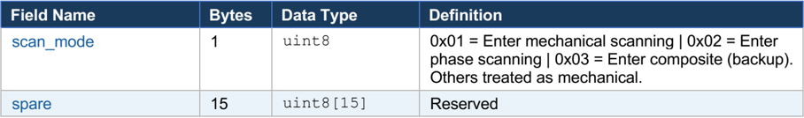

## RDXXB SERIES RADAR

## External Communication Protocol

## X-Band · Mechanically Scanned · Drone Detection

| Version        | V1.0                |
|----------------|---------------------|
| Release Date   | 21 April 2026       |
| Scope          | RDXXB Full Series   |
| Protocol       | UDP · Little-Endian |
| Classification | Technical Reference |

## 1. Document Overview

This document specifies the external communication protocol for the RDXXB series of mechanically scanned radars and their associated display/control systems. The protocol defines the complete set of UDP frame formats for command, status, and target data exchange between a radar front-end and a display/control application.

## 1.1 Version History

| Date       | Previous   | New   | Changes         |
|------------|------------|-------|-----------------|
| 21-04-2026 | -          | v1.0  | Initial version |

## 2. Communication Protocol

All communication between the radar and the display/control system uses the UDP network protocol. All multi-byte fields are encoded in little-endian order (low byte first, high byte last).

## 2.1 Network Configuration

| Endpoint                 | IP Address      |   Port | Direction                                                       |
|--------------------------|-----------------|--------|-----------------------------------------------------------------|
| Display / Control System | 192.168.1.2     |   8000 | Receives data; sends commands                                   |
| Radar Unit               | 192.168.1.3     |   7000 | Sends target/status data; receives commands                     |
| Broadcast (Discovery)    | 255.255.255.255 |  11111 | Control sends arbitrary content; radar replies with IP and port |

## 2.2 Byte Order

All data fields wider than one byte are transmitted in little-endian byte order: the least-significant byte (low byte) is placed first, the most-significant byte (high byte) last.

⚑ Note: Example: the value 0x1234 is transmitted as bytes [0x34, 0x12] on the wire.

## 2.3 Frame Identifier Map

| Frame ID   | Frame Name                        | Direction       | Notes                      |
|------------|-----------------------------------|-----------------|----------------------------|
| 0xFF00     | Mode Command Frame                | Display → Radar | Controls operating mode    |
| 0xFF01     | Tracking Target Information Frame | Radar → Display | Per-pulse, variable length |
| 0xFF02     | Search Target Information Frame   | Radar → Display | Per-pulse, variable length |
| 0xFF03     | Status Information Frame          | Radar → Display | ~200 ms period             |
| 0xFF04     | Parameter Update Frame            | Display → Radar | In search mode only        |
| 0xFF05     | Scan Mode Switching Command Frame | Display → Radar | Switches scan strategy     |
| 0xFF30     | RESERVED                          | -               | Do NOT transmit            |
| 0xFF31     | RESERVED                          | -               | Do NOT transmit            |
| 0xFF32     | RESERVED                          | -               | Do NOT transmit            |
| 0xFF33     | Network Configuration Frame       | Bidirectional   | Discovery / response       |
| 0xFF34     | RESERVED                          | -               | Do NOT transmit            |

## 3. Data Protocol

## 3.1 Universal Frame Format

Every communication frame-regardless of type-shares the following outer wrapper. The frame content is the only variable-length portion; its size in bytes is reported by content\_length.

| Field Name     | Bytes   | Data Type   | Value / Description                                                                                                                                                                          |
|----------------|---------|-------------|----------------------------------------------------------------------------------------------------------------------------------------------------------------------------------------------|
| frame_header   | 2       | uint16 (LE) | Always 0x55AA -magic bytes to identify a valid frame                                                                                                                                         |
| frame_id       | 2       | uint16 (LE) | Frame type identifier (see Section 2.3)                                                                                                                                                      |
| frame_count    | 4       | uint32 (LE) | Monotonic counter 0x00000000 - 0xFFFFFFFF; wraps around; receiver-synchronized                                                                                                               |
| content_length | 4       | uint32 (LE) | Byte size of the frame_content field (n)                                                                                                                                                     |
| protocol_id    | 1       | uint8       | Radar device ID: 1=RD01, 2=RD02, …8=RD08. Frames with an unrecognized ID must be silently ignored                                                                                            |
| protocol_major | 1       | uint8       | Major version (default: 2). A higher major version means a newer, potentially incompatible protocol. New software reads old protocols; old software is NOT guaranteed to read new protocols. |
| protocol_minor | 1       | uint8       | Minor version (default: 13 for V2.13/V2.14). Within the same major version, both forward and backward compatibility are guaranteed.                                                          |
| checksum       | 1       | uint8       | uint8 accumulation of all bytes EXCEPT the 2-byte frame_header. Take the least-significant byte of the sum.                                                                                  |
| frame_content  | n       | bytes       | Frame-type-specific payload. Length is given by content_length.                                                                                                                              |

⚑ Note:

Total frame size = 16 + n bytes.

## 3.2 Frame Content

## 3.2.1 Mode Command Frame (0xFF00)

Sent by the display/control system to set or change the radar's operating mode and configuration. The radar defaults to Standby mode on power-on and does NOT respond to duplicate commands. Three modes exist: Standby, Search, and Track. A Leveling mode is also available for pre-operation platform calibration.

## Operating Mode Codes

| Code   | Mode     | Description                                                                                                    |
|--------|----------|----------------------------------------------------------------------------------------------------------------|
| 0x00   | Standby  | Default on power-on. Radar is powered but not scanning.                                                        |
| 0x11   | Search   | 360° scan mode. Radar sweeps and reports detected targets per pulse group.                                     |
| 0x22   | Track    | Closed-loop tracking of a designated target.                                                                   |
| 0x33   | Leveling | Platform auto-leveling. Set servo to circular scan mode in the command. Do not perform other operations during |

## Standby / Search Mode Frame Fields

| Field Name           |   Bytes | Data Type   | Definition / Values                                                                                                                          |
|----------------------|---------|-------------|----------------------------------------------------------------------------------------------------------------------------------------------|
| mode_type            |       1 | uint8       | 0x00 = Standby &#124; 0x11 = Search &#124; 0x33 = Leveling                                                                                   |
| spare                |       4 | char[4]     | Reserved, internal use only, fill 0                                                                                                          |
| frequency            |       1 | uint8       | Frequency code 0-20 (see Appendix 1). Default: 10 →9.50 GHz                                                                                  |
| silent_zone_1_start  |       2 | uint16      | 0-3600 (×0.1°). 0x7FFF = invalid/disabled. e.g. 1805 = 180.5°                                                                                |
| silent_zone_1_end    |       2 | uint16      | 0-3600 (×0.1°). 0x7FFF = invalid/disabled                                                                                                    |
| silent_zone_2_start  |       2 | uint16      | 0-3600 (×0.1°). 0x7FFF = invalid/disabled                                                                                                    |
| silent_zone_2_end    |       2 | uint16      | 0-3600 (×0.1°). 0x7FFF = invalid/disabled                                                                                                    |
| dist_compensation    |       2 | short       | Distance compensation offset. Precision 0.1. Default 0. e.g. 2.3 m→send 23                                                                   |
| az_compensation      |       2 | short       | Azimuth compensation offset in degrees. Precision 0.1°. Default 0                                                                            |
| pitch_compensation   |       2 | short       | Pitch compensation offset in degrees. Precision 0.1°. Default 0                                                                              |
| scan_cycle           |       2 | short       | Scan cycle in 0.1 s increments. Default 32 = 3.2 s. Valid in both Standby and Search.                                                        |
| servo_mode           |       1 | uint8       | 0x11=Pointing &#124; 0x33=Circular Scan &#124; 0x77=Pull locking pin &#124; 0x88=Insert pin &#124; 0xFF=Idle (default in Standby and Search) |
| servo_pointing_angle |       2 | uint16      | Target angle 0-3600 (×0.1°) for pointing mode only. e.g. 180.5° →1805                                                                        |
| sys_control_flag     |       1 | uint8       | 0x00 = do NOT execute system control code &#124; 0x01 = execute system control code. Standby only.                                           |
| sys_control_code     |       1 | uint8       | 0x01 = power off radar. All others = no action. Standby only.                                                                                |
| manual_pitch_enable  |       1 | char        | 0x00 = Disabled (use leveling data) &#124; 0x011 = Enabled (use array-mounted pitch angle instead)                                           |
| spare2               |       8 | char[8]     | Reserved, fill 0                                                                                                                             |
| longitude            |       8 | double      | Installation site GPS longitude. 6 decimal places.                                                                                           |
| latitude             |       8 | double      | Installation site GPS latitude. 6 decimal places.                                                                                            |
| altitude             |       8 | double      | Installation site elevation. 6 decimal places.                                                                                               |
| altitude_range       |       1 | uint8       | 0x11 = 7.5 km range &#124; 0x22 = 15 km range. Default: 0x11                                                                                 |
| spare_config         |     256 | char[256]   | Reserved configuration block                                                                                                                 |
| height_min_near      |       2 | short       | Min height filter for targets ≤3 km. Precision 1 m. Default0m                                                                                |
| height_min_far       |       2 | short       | Min height filter for targets >3 km. Precision 1 m. Default 100m                                                                             |
| height_max           |       2 | short       | Max height filter; remove targets at or above this. Precision 1 m. Default 600m                                                              |

| speed_min           |   2 | uint16    | Min absolute speed filter (×0.1 m/s). Default 0                                                                      |
|---------------------|-----|-----------|----------------------------------------------------------------------------------------------------------------------|
| speed_max           |   2 | uint16    | Max absolute speed filter (×0.1 m/s). Default 600 = 60 m/s. e.g. 12.3 m/s →123                                       |
| spare3              |   2 | uint8     | Reserved                                                                                                             |
| range_max           |   2 | uint16    | Remove targets further than this distance (m). Default 7500m                                                         |
| range_min           |   2 | uint16    | Remove targets closer than this distance (m). Default 200m                                                           |
| spare4              |  30 | uint8[30] | Reserved                                                                                                             |
| roll_angle_install  |   4 | float     | Array-installed roll angle (2 decimal places). Positive = left-low-right-high viewed along radial. Default 0.0       |
| pitch_angle_install |   4 | float     | Array-installed pitch angle (2 decimal places). Positive = front-low-back-high viewed along radial. Default 0.0      |
| north_angle         |   4 | float     | North correction angle. Range [0, 360]. Default 0.0. If GPS heading is valid, recalculated by Appendix II algorithm. |
| auto_id_enable      |   1 | char      | 0 = Disabled (ID only via track path) &#124; 1 = Enabled (also identifies from search; longer search period)         |
| auto_id_max_targets |   1 | char      | Max targets for autonomous ID. Range: 1-2. Default 2                                                                 |
| spare5              |  30 | char[30]  | Reserved                                                                                                             |

## Tracking Mode Frame Fields

When the mode type is set to Track (0x22), two additional fields replace the standard body:

| Field Name   |   Bytes | Data Type   | Definition / Values                                 |
|--------------|---------|-------------|-----------------------------------------------------|
| mode_type    |       1 | uint8       | 0x22 = Tracking mode                                |
| track_action |       1 | uint8       | 0x11 = Enter tracking &#124; 0x22 = Cancel tracking |
| target_count |       2 | uint16      | Fixed value: 1 (number of targets being tracked)    |
| spare        |     128 | char[128]   | Reserved                                            |

## 3.2.2 Status Information Frame (0xFF03)

The radar transmits this frame approximately every 200 ms (non-strict interval). It contains comprehensive health, configuration, and navigation telemetry. Clients may selectively display fields as needed.

| Field Name           |   Bytes | Data Type   | Definition / Values                                                              |
|----------------------|---------|-------------|----------------------------------------------------------------------------------|
| work_mode            |       1 | uint8       | 0x00=Standby &#124; 0x11=Search &#124; 0x22=Track &#124; 0x33=Leveling           |
| cmd_exec_status      |       1 | uint8       | 0x00=Idle &#124; 0x11=Executing &#124; 0x22=Success &#124; 0x33=Failed           |
| fault_type           |       1 | uint8       | 0x00=None &#124; 0x01=Parse fail &#124; 0x02=Cannot execute &#124; Others=custom |
| radar_model          |       1 | uint8       | 0x01-0x10 →RD01-RD10                                                             |
| frontend_count_id    |       1 | uint8       | Number of front-ends and ID. Fixed: 0x01                                         |
| frontend1_net_status |       1 | uint8       | 0=Not connected &#124; 1=Connected                                               |
| frontend1_scan_cycle |       4 | uint32      | Current scan cycle value                                                         |
| frontend1_azimuth    |       4 | float       | [0, 360] degrees                                                                 |
| frontend1_pitch      |       4 | float       | [0, 360] degrees                                                                 |
| frontend1_frequency  |       2 | uint16      | 0-20; 0=9.2 GHz, 20=9.8 GHz (see Appendix 1)                                     |
| spare_fe             |       1 | uint8       | Reserved                                                                         |
| silent_zone1_start   |       2 | short       | 0-3600 (×0.1°), 0x7FFF = invalid                                                 |
| silent_zone1_end     |       2 | short       | 0-3600 (×0.1°), 0x7FFF = invalid                                                 |
| silent_zone2_start   |       2 | short       | 0-3600 (×0.1°), 0x7FFF = invalid                                                 |
| silent_zone2_end     |       2 | short       | 0-3600 (×0.1°), 0x7FFF = invalid                                                 |
| spare_sz             |      16 | char[16]    | Reserved                                                                         |
| fan_status           |       1 | uint8       | Bits[1:0]=Fan1, [3:2]=Fan2, [5:4]=Fan3, [7:6]=Fan4. 0=Fault, 1=Normal            |
| freq_synth_status    |       1 | uint8       | Bit0=LO1, Bit1=LO2. 0=Fault, 1=Normal                                            |

## 3.2.3 Search Target Information Frame (0xFF02)

The radar transmits this frame every pulse group - even when no targets are detected. In that case, only the header is sent with target\_count = 0. The frame is variable-length: total body size = N × 148 bytes where N = target\_count.

## Search Frame Header (20 bytes, fixed)

| Field Name       |   Bytes | Data Type   | Definition                             |
|------------------|---------|-------------|----------------------------------------|
| search_azimuth   |       4 | float       | Current scan azimuth angle (degrees)   |
| search_elevation |       4 | float       | Current scan elevation angle (degrees) |
| scan_cycle       |       4 | uint32      | Scan cycle counter                     |
| pulse_group_id   |       4 | uint32      | Current pulse group sequence number    |
| target_count     |       2 | uint16      | Number of target records N in body     |
| spare            |       2 | uint8       | Always 0x0000                          |

## Search Frame Body - Per-Target Record (148 bytes each)

| Field Name        |   Bytes | Data Type   | Definition                                               |
|-------------------|---------|-------------|----------------------------------------------------------|
| track_delete_flag |       2 | uint16      | 0x00 = Active track &#124; 0x01 = Track deleted          |
| track_id          |       2 | uint16      | Track ID number: 0 - 10000 (tentative maximum)           |
| loss_count        |       2 | uint16      | Consecutive loss count in CPI units                      |
| loss_reason       |       2 | uint16      | Reason code for track loss                               |
| update_time       |       4 | uint32      | Track update timestamp (pulse group units)               |
| energy            |       4 | float       | Received signal energy (32-bit IEEE 754)                 |
| credit_ratio      |       4 | float       | Track quality / credit ratio (32-bit IEEE 754)           |
| speed             |       4 | float       | Radial speed (m/s, 32-bit IEEE 754)                      |
| distance          |       4 | float       | Slant range to target (m, 32-bit IEEE 754)               |
| azimuth           |       4 | float       | Target azimuth angle (degrees, 0-360, 32-bit IEEE 754)   |
| pitch             |       4 | float       | Target elevation/pitch angle (degrees, 32-bit IEEE 754)  |
| height            |       4 | float       | Target height above reference (m, 32-bit IEEE 754)       |
| track_type        |       1 | uint8       | Target class code (see Section 4: Target Classification) |
| attributes        |       1 | uint8       | Bit-field: search and/or track association flags         |
| radar_id          |       1 | uint8       | Radar front-end ID (1-8)                                 |
| spare1            |       3 | uint8[3]    | Reserved                                                 |
| track_point_count |       2 | uint16      | Number of historical track points accumulated            |
| longitude         |       8 | double      | WGS-84 target longitude. 6 decimal places.               |
| latitude          |       8 | double      | WGS-84 target latitude. 6 decimal places.                |
| altitude_gps      |       8 | double      | GPS-derived target altitude (m). 6 decimal places.       |
| vx                |       4 | float       | Velocity East component (m/s)                            |
| vy                |       4 | float       | Velocity North component (m/s)                           |

| vz                   |   4 | float     | Velocity Up component (m/s)                                        |
|----------------------|-----|-----------|--------------------------------------------------------------------|
| spare_vel            |  22 | uint8[22] | Reserved                                                           |
| envelope_point_count |   1 | uint8     | Number of envelope boundary points                                 |
| spare_env            |  13 | uint8[13] | Reserved                                                           |
| utc_year             |   2 | short     | UTC year (e.g. 2025)                                               |
| utc_month            |   1 | char      | UTC month (1-12)                                                   |
| utc_day              |   1 | char      | UTC day (1-31)                                                     |
| utc_hour             |   1 | char      | UTC hour (0-23)                                                    |
| utc_minute           |   1 | char      | UTC minute (0-59)                                                  |
| utc_second           |   1 | char      | UTC second (0-59)                                                  |
| utc_millisecond      |   1 | char      | UTC millisecond: 0-99 →0-990 ms (×10 ms precision)                 |
| spare2               |  19 | uint8[19] | Reserved                                                           |
| confidence           |   1 | uint8     | Target confidence score. Precision 0.01. Value 87 →confidence 0.87 |

## 3.2.4 Tracking Target Information Frame (0xFF01)

Identical structure to the Search Target frame (Section 3.2.3), with the following differences: in mechanical scanning mode, target\_count in the header is fixed at 1. The frame is still sent every pulse group even with no target, in which case the body is empty.

⚑ Note: The per-target body record (148 bytes) is identical to the Search frame body. Refer to Section 3.2.3 for field definitions.

## Tracking Frame Header (20 bytes, fixed)

| Field Name       |   Bytes | Data Type   | Definition                                                |
|------------------|---------|-------------|-----------------------------------------------------------|
| search_azimuth   |       4 | float       | Current scan azimuth angle (degrees)                      |
| search_elevation |       4 | float       | Current scan elevation angle (degrees)                    |
| scan_cycle       |       4 | uint32      | Scan cycle counter                                        |
| pulse_group_id   |       4 | uint32      | Current pulse group sequence number                       |
| target_count     |       2 | uint16      | Number of targets -fixed at 1 in mechanical scanning mode |
| spare            |       2 | uint8       | Always 0x0000                                             |

## 3.2.5 Parameter Update Frame (0xFF04)

Used to dynamically update detection thresholds while the radar is in Search mode. The radar applies these settings to its track management on the next update cycle. This frame may be sent repeatedly.

| Field Name      |   Bytes | Data Type   | Definition                                                    |
|-----------------|---------|-------------|---------------------------------------------------------------|
| spare_header    |     317 | char[317]   | Reserved header block                                         |
| height_min_near |       2 | short       | Min height filter for targets ≤3 km zone (precision 1 m)      |
| height_min_far  |       2 | short       | Min height filter for targets >3 km zone (precision 1 m)      |
| height_max      |       2 | short       | Max height -remove targets at or above (precision 1 m)        |
| speed_min       |       2 | uint16      | Min absolute speed filter (×0.1 m/s)                          |
| speed_max       |       2 | uint16      | Max absolute speed filter (×0.1 m/s). e.g. 12.3 m/s →send 123 |
| spare_filt      |       2 | uint8       | Reserved                                                      |
| range_max       |       2 | uint16      | Remove targets further than this distance (precision 1 m)     |
| range_min       |       2 | uint16      | Remove targets closer than this distance (precision 1 m)      |
| spare_end       |      74 | char[74]    | Reserved                                                      |

## 3.2.6 Scan Mode Switching Command Frame (0xFF05)

The display/control sends this frame to switch the radar's scanning strategy. The data processing software safely exits the current mode before entering the new one. Duplicate commands are ignored. The servo can only be controlled in mechanical scanning mode - point the servo to the desired angle BEFORE switching to phase scan mode.



| Field Name   |   Bytes | Data Type   | Definition                                                                                                                                |
|--------------|---------|-------------|-------------------------------------------------------------------------------------------------------------------------------------------|
| scan_mode    |       1 | uint8       | 0x01 = Enter mechanical scanning &#124; 0x02 = Enter phase scanning &#124; 0x03 = Enter composite (backup). Others treated as mechanical. |
| spare        |      15 | uint8[15]   | Reserved                                                                                                                                  |

⚑ Note: In phase scan mode, GPS and inclinometer data cannot be obtained from the current servo angle by default.

## 4. Target Classification

The track\_type field in every target record uses the following codes to identify the detected object. Autonomous identification (enabled via auto\_id\_enable in the Mode Command) uses flight-path analysis and, when enabled, search-phase pattern recognition.

| Code (hex)   | Label        | Description                                             |
|--------------|--------------|---------------------------------------------------------|
| 0x00         | Unknown      | Classification not yet determined or unavailable        |
| 0x11         | Person       | Human on foot                                           |
| 0x12         | Car          | Ground vehicle                                          |
| 0x20         | Drone        | Unmanned aerial vehicle (UAV/UAS)                       |
| 0x24         | Bird         | Avian - bird or flock                                   |
| 0x31         | Vessel       | Surface watercraft                                      |
| 0x40         | Other        | Airborne or ground object not in other categories       |
| 0x41         | False Target | Detected echo determined to be a false alarm or clutter |

## 5. Coordinate System and Unit Reference

## 5.1 Angular Encoding (Integer Fields)

Azimuth and elevation angles in command frames are sent as 16-bit unsigned integers with a resolution of 0.1 degrees. To convert:

```
angle_degrees = raw_integer_value × 0.1
```

Example: raw value 1805 → 180.5°. Raw value 3600 → 360.0°.

Invalid azimuth/elevation is marked with the sentinel value 0x7FFF.

## 5.2 Speed Encoding (Integer Fields in Command/Update Frames)

```
speed_ms = raw_integer_value × 0.1  [m/s]
```

Example: raw value 123 → 12.3 m/s.

## 5.3 UTC Timestamp Milliseconds

The utc\_millisecond field stores values 0-99, representing 0-990 ms at 10 ms precision.

```
actual_ms = utc_millisecond × 10  [ms]
```

## 5.4 Confidence Field

The confidence field in target records uses integer representation at 0.01 precision:

```
confidence_ratio = confidence_byte × 0.01
```

Example: value 87 → confidence ratio 0.87.

## 5.5 Geodetic Coordinates

Longitude, latitude, and altitude in target records are IEEE 754 64-bit doubles (WGS-84 datum), reserved to 6 decimal places of precision. Velocity components Vx (East), Vy (North), and Vz (Up) use the ENU (East-North-Up) reference frame in units of m/s.

## 5.6 Inclinometer Axis Convention

Roll and pitch angles use the following sign convention:

| Field       | Axis             | Positive direction                         | Negative direction   |
|-------------|------------------|--------------------------------------------|----------------------|
| roll_angle  | X (inclinometer) | Left-low, right-high (viewed along radial) | Left-high, right-low |
| pitch_angle | Y (inclinometer) | Front-low, back-high (viewed along radial) | Front-high, back-low |

## 6. Comprehensive JSON Tracking Output (All Available Data)

The following JSON represents a complete decoded Search Target Information Frame (0xFF02) with ALL available fields from both the Status Information Frame (radar device data) and the target records. This is the COMPLETE dataset available from the RDXXB protocol. Select only the fields you need for your application.

```
{ "frame_metadata": { "frame_header": "0x55AA", "frame_id": "0xFF02", "frame_type": "search_target_information", "frame_count": 84231, "frame_timestamp_utc": "2025-12-17T08:34:51.820Z" }, "protocol": { "id": 1, "device_code": "RD01", "major_version": 2, "minor_version": 14, "checksum_valid": true }, "radar_device": { "device_id": 1, "device_label": "Front-End Radar 1", "model_code": "0x01", "model_name": "RD01", "network": { "ip_address": "192.168.1.3", "port": 7000, "status": "connected", "frontend_network_status": 1 }, "gps": { "longitude": 107.608234, "latitude": -6.897456, "elevation_m": 150.0, "heading_angle_deg": 45.0, "heading_valid": true, "satellite_count": 12, "installed_location_name": "Bandung, West Java, Indonesia" }, "orientation": { "roll_angle_deg": 0.5, "pitch_angle_deg": 1.2, "north_correction_angle_deg": 8.5, "inclinometer_z": 0.1 }, "operational_state": { "work_mode": "0x11", "work_mode_label": "search", "cmd_execution_status": "0x22", "cmd_execution_label": "success", "fault_type": "0x00", "fault_label": "none", "servo_mode": "0x33", "servo_mode_label": "circular_scan",
```

```
"scan_mode": "0x01", "scan_mode_label": "mechanical_scanning" }, "servo": { "status_bits": { "encoder_communication_ok": true, "driver_communication_ok": true, "instruction_timeout": false, "command_valid": true, "pin_inserted": true, "pin_pulled_out": true }, "current_azimuth_deg": 142.3, "current_pitch_deg": 5.1, "current_scan_cycle": 47 }, "frequency": { "current_code": 10, "current_x_band_ghz": 9.5, "current_ku_band_ghz": 16.2, "synthesis_status": "0x03", "synthesis_status_label": "normal" }, "silent_zones": [ { "zone_number": 1, "start_angle_deg": 180.0, "end_angle_deg": 200.0, "enabled": true }, { "zone_number": 2, "start_angle_deg": 0.0, "end_angle_deg": 0.0, "enabled": false } ], "filters": { "height_min_near_zone_m": 50, "height_min_far_zone_m": 100, "height_max_m": 600, "speed_min_ms": 0.0, "speed_max_ms": 60.0, "range_min_m": 200, "range_max_m": 7500, "altitude_range_mode": "0x11", "altitude_range_km": 7.5 }, "autonomous_identification": { "enabled": true, "max_targets": 2 }, "thermals": { "subarray": [ { "index": 1, "temperature_c": 45 }, { "index": 2, "temperature_c": 44 }, { "index": 3, "temperature_c": 46 }, { "index": 4, "temperature_c": 45 }, { "index": 5, "wave_controller_version": "1.2" }, { "index": 6, "spare": 0 }, { "index": 7, "spare": 0 }, { "index": 8, "spare": 0 }
```

```
], "signal_board_temperature_c": 52, "frequency_synthesizer_temperature_c": 48.5, "frequency_synthesizer_id": "FS-001" }, "power": { "subarray_currents_a": [ { "index": 1, "current_a": 5.4 }, { "index": 2, "current_a": 5.3 }, { "index": 3, "current_a": 5.5 }, { "index": 4, "current_a": 5.4 }, { "index": 5, "current_a": 2.1 }, { "index": 6, "current_a": 2.0 }, { "index": 7, "current_a": 2.1 }, { "index": 8, "current_a": 2.0 } ], "signal_voltages_v": [ { "channel": 1, "voltage_v": 12 }, { "channel": 2, "voltage_v": 5 }, { "channel": 3, "voltage_v": 3.3 } ] }, "system_health": { "fan_status": { "fan1": "normal", "fan2": "normal", "fan3": "normal", "fan4": "normal" }, "memory_status": { "qdr_initialized": true, "ddr_0_initialized": true, "ddr_1_initialized": true, "pcie_link_ok": true }, "ad_channels": { "sum_channel_over_range": false, "pitch_channel_over_range": false, "azimuth_channel_over_range": false, "backup_channel_over_range": false } }, "firmware": { "fpga_version": "v3.21", "data_processing_version": "2.14.05.2025", "pitch_frame_angle": 0.0, "pitch_adjustment_level": 0.0 } }, "scan_header": { "search_azimuth_deg": 142.3, "search_elevation_deg": 5.1, "scan_cycle_count": 47, "pulse_group_id": 113842, "target_count": 2 }, "targets": [ { "track_identification": { "track_id": 1042,
```

```
"track_delete_flag": "0x00", "track_status": "active", "loss_count_cpi": 0, "loss_reason_code": 0, "update_time_cpi": 113842, "age_pulses": 0 }, "classification": { "track_type_code": "0x20", "track_type_label": "drone", "attributes_bitfield": "0x01", "radar_frontend_id": 1, "confidence": 0.87, "confidence_pct": "87%" }, "signal_quality": { "energy": 2847.43, "energy_normalized": 0.92, "credit_ratio": 0.92, "credit_ratio_pct": "92%" }, "polar_coordinates": { "distance_m": 1243.7, "azimuth_deg": 142.3, "elevation_pitch_deg": 7.2, "height_m": 155.8, "radial_speed_ms": -3.4, "radial_speed_label": "approaching" }, "geodetic_coordinates": { "longitude": 107.612483, "latitude": -6.903124, "altitude_m": 156.0, "distance_from_radar_m": 1243.7, "bearing_from_radar_deg": 142.3, "altitude_above_radar_m": 6.0 }, "velocity_enu": { "vx_east_ms": -2.1, "vy_north_ms": -2.7, "vz_up_ms": 0.3, "total_speed_ms": 3.42, "horizontal_speed_ms": 3.41, "vertical_direction": "ascending" }, "track_history": { "track_point_count": 38, "envelope_point_count": 6, "track_age_pulses": 38, "track_confidence_accumulated": true }, "utc_timestamp": { "year": 2025, "month": 12, "day": 17, "hour": 8, "minute": 34, "second": 51, "millisecond": 820, "millisecond_precision_10ms": 82, "iso8601": "2025-12-17T08:34:51.820Z", "unix_timestamp": 1766049291.82
```

```
} }, { "track_identification": { "track_id": 1051, "track_delete_flag": "0x00", "track_status": "active", "loss_count_cpi": 2, "loss_reason_code": 0, "update_time_cpi": 113840, "age_pulses": 2 }, "classification": { "track_type_code": "0x20", "track_type_label": "drone", "attributes_bitfield": "0x01", "radar_frontend_id": 1, "confidence": 0.74, "confidence_pct": "74%" }, "signal_quality": { "energy": 1921.05, "energy_normalized": 0.62, "credit_ratio": 0.78, "credit_ratio_pct": "78%" }, "polar_coordinates": { "distance_m": 2781.2, "azimuth_deg": 138.7, "elevation_pitch_deg": 3.9, "height_m": 189.4, "radial_speed_ms": 5.1, "radial_speed_label": "receding" }, "geodetic_coordinates": { "longitude": 107.635817, "latitude": -6.921089, "altitude_m": 190.0, "distance_from_radar_m": 2781.2, "bearing_from_radar_deg": 138.7, "altitude_above_radar_m": 40.0 }, "velocity_enu": { "vx_east_ms": 4.2, "vy_north_ms": 2.8, "vz_up_ms": -0.6, "total_speed_ms": 5.05, "horizontal_speed_ms": 5.02, "vertical_direction": "descending" }, "track_history": { "track_point_count": 14, "envelope_point_count": 4, "track_age_pulses": 14, "track_confidence_accumulated": true }, "utc_timestamp": { "year": 2025, "month": 12, "day": 17, "hour": 8, "minute": 34,
```

"second": 51, "millisecond": 820, "millisecond\_precision\_10ms": 82, "iso8601": "2025-12-17T08:34:51.820Z", "unix\_timestamp": 1766049291.82 } } ] }

## 6.1 Comprehensive JSON Field Reference

This table documents EVERY field in the comprehensive JSON output, including fields from the Status Information Frame (0xFF03) that provide radar device/system data, not just target tracking data. This is the COMPLETE dataset available from the protocol.

| JSON Field Path                          | Data Type   | Source Frame                  | Units           | Purpose & Usage                                                     |
|------------------------------------------|-------------|-------------------------------|-----------------|---------------------------------------------------------------------|
| frame_metadata.frame_header              | hex string  | Universal frame header        | -               | Always 0x55AA. Frame synchronization.                               |
| frame_metadata.frame_id                  | hex string  | Frame ID field                | -               | Identifies frame type (0xFF02=search, 0xFF01=track, 0xFF03=status). |
| frame_metadata.frame_type                | string      | Derived                       | -               | Human-readable frame type name.                                     |
| frame_metadata.frame_count               | integer     | frame_count field             | counts          | Monotonic counter. Detect dropped frames.                           |
| frame_metadata.frame_timestamp_utc       | ISO 8601    | UTC fields                    | string          | Complete frame transmission timestamp.                              |
| protocol.id                              | integer     | protocol_id                   | -               | Radar device ID (1-8). Multi-radar systems.                         |
| protocol.device_code                     | string      | Derived from ID               | -               | RD01-RD08 format.                                                   |
| protocol.major_version                   | integer     | protocol_major                | -               | Major version: forward- compat only.                                |
| protocol.minor_version                   | integer     | protocol_minor                | -               | Minor version: full compat within major.                            |
| protocol.checksum_valid                  | boolea n    | Derived                       | -               | Verified frame integrity.                                           |
| radar_device.device_id                   | integer     | frontend_count_id             | -               | Radar unit ID. Fixed at 1 for single-head.                          |
| radar_device.device_label                | string      | Status frame                  | -               | Human-readable device name/label.                                   |
| radar_device.model_code                  | hex         | radar_model field             | -               | 0x01-0x10 →RD01- RD10.                                              |
| radar_device.model_name                  | string      | Derived                       | -               | RD01, RD02, etc.                                                    |
| radar_device.network.ip_address          | string      | Status frame                  | IPv4            | Radar unit IP address.                                              |
| radar_device.network.port                | integer     | Status frame                  | port            | Radar UDP listening port (7000).                                    |
| radar_device.network.status              | string      | Status: frontend1_net_statu s | -               | Connected/disconnecte d state.                                      |
| radar_device.gps.longitude               | float       | Status frame: longitude       | degrees WGS- 84 | Radar installation longitude (6 decimals).                          |
| radar_device.gps.latitude                | float       | Status frame: latitude        | degrees WGS- 84 | Radar installation latitude (6 decimals).                           |
| radar_device.gps.elevation_m             | float       | Status frame: elevation       | meters          | Radar antenna height above sea level.                               |
| radar_device.gps.heading_angle_deg       | float       | Status frame: heading_angle   | degrees [0,360] | Geographic azimuth radar points (from GPS). For north correction.   |
| radar_device.gps.heading_valid           | boolea n    | Status frame: heading_valid   | -               | Is GPS heading locked and trustworthy?                              |
| radar_device.gps.satellite_count         | integer     | Status frame: satellite_count | sats            | Number of GPS satellites locked. ≥8 preferred.                      |
| radar_device.gps.installed_location_name | string      | Manual/config                 | -               | Optional: friendly location name.                                   |
| radar_device.orientation.roll_angle_deg  | float       | Status frame: roll_angle      | degrees         | Inclinometer X-axis. Left-low/right-high = positive.                |

| radar_device.orientation.pitch_angle_deg            | float    | Status frame: pitch_angle           | degrees         | Inclinometer Y-axis. Front-low/back-high = positive.                  |
|-----------------------------------------------------|----------|-------------------------------------|-----------------|-----------------------------------------------------------------------|
| radar_device.orientation.north_correction_angle_deg | float    | Status frame: north_angle           | degrees [0,360] | Calculated north correction. Use directly in Standby mode.            |
| radar_device.orientation.inclinometer_z             | float    | Status frame: inclinometer_z        | -               | Z-axis reading (reference only).                                      |
| radar_device.operational_state.work_mode            | hex      | Status frame: work_mode             | -               | 0x00=Standby, 0x11=Search, 0x22=Track, 0x33=Leveling.                 |
| radar_device.operational_state.work_mode_label      | string   | Derived                             | -               | Human-readable mode name.                                             |
| radar_device.operational_state.cmd_execution_status | hex      | Status frame: cmd_exec_status       | -               | 0x00=Idle, 0x11=Executing, 0x22=Success, 0x33=Failed.                 |
| radar_device.operational_state.fault_type           | hex      | Status frame: fault_type            | -               | 0x00=None, 0x01=Parse fail, 0x02=Cannot execute.                      |
| radar_device.operational_state.servo_mode           | hex      | Status frame: servo_mode            | -               | 0x11=Point, 0x33=Circular, 0x77=Pull pin, 0x88=Insert pin, 0xFF=Idle. |
| radar_device.operational_state.scan_mode            | hex      | Status frame: scan_mode             | -               | 0x01=Mechanical, 0x02=Phase, 0x03=Composite.                          |
| radar_device.servo.status_bits.*                    | boolea n | Status frame: servo_status          | -               | Encoder/driver comm, timeout, validity, pin status.                   |
| radar_device.servo.current_azimuth_deg              | float    | Status frame: frontend1_azimuth     | degrees [0,360] | Current servo azimuth angle.                                          |
| radar_device.servo.current_pitch_deg                | float    | Status frame: frontend1_pitch       | degrees [0,360] | Current servo elevation angle.                                        |
| radar_device.servo.current_scan_cycle               | integer  | Status frame: frontend1_scan_cycl e | counts          | Scan cycle counter (increments per sweep).                            |
| radar_device.frequency.current_code                 | integer  | Status frame: frontend1_frequency   | code 0- 20      | Frequency selection code.                                             |
| radar_device.frequency.current_x_band_ghz           | float    | Appendix 1 lookup                   | GHz             | X-Band frequency (9.20-9.80 GHz).                                     |
| radar_device.frequency.current_ku_band_ghz          | float    | Appendix 1 lookup                   | GHz             | Ku-Band frequency (15.70-16.70 GHz).                                  |
| radar_device.frequency.synthesis_status             | hex      | Status frame: freq_synth_status     | -               | LO1 and LO2 lock status.                                              |
| radar_device.silent_zones[].zone_number             | integer  | Mode command                        | -               | Zone 1 or 2.                                                          |
| radar_device.silent_zones[].start_angle_deg         | float    | Mode command                        | degrees         | Silent zone start azimuth.                                            |
| radar_device.silent_zones[].end_angle_deg           | float    | Mode command                        | degrees         | Silent zone end azimuth.                                              |
| radar_device.silent_zones[].enabled                 | boolea n | Mode command: 0x7FFF check          | -               | Is this zone active?                                                  |
| radar_device.filters.height_min_near_zone_m         | float    | Mode/Status frames                  | meters          | Min height filter ≤3 km zone.                                         |
| radar_device.filters.height_min_far_zone_m          | float    | Mode/Status frames                  | meters          | Min height filter >3 km zone.                                         |
| radar_device.filters.height_max_m                   | float    | Mode/Status frames                  | meters          | Remove targets at/above this height.                                  |
| radar_device.filters.speed_min_ms                   | float    | Mode/Status frames                  | m/s             | Remove targets slower than this (×0.1).                               |
| radar_device.filters.speed_max_ms                   | float    | Mode/Status frames                  | m/s             | Remove targets faster than this (×0.1).                               |

| radar_device.filters.range_min_m                           | float    | Mode/Status frames                    | meters     | Remove targets closer than this.                     |
|------------------------------------------------------------|----------|---------------------------------------|------------|------------------------------------------------------|
| radar_device.filters.range_max_m                           | float    | Mode/Status frames                    | meters     | Remove targets further than this.                    |
| radar_device.filters.altitude_range_mode                   | hex      | Mode command                          | -          | 0x11=7.5km, 0x22=15km.                               |
| radar_device.autonomous_identification.enabled             | boolea n | Mode command                          | -          | Auto ID for search + track, or track-only.           |
| radar_device.autonomous_identification.max_targets         | integer  | Mode command                          | targets    | 1-2. Max targets for autonomous ID.                  |
| radar_device.thermals.subarray[].index                     | integer  | Status frame                          | -          | Subarray 1-8.                                        |
| radar_device.thermals.subarray[].temperature_c             | float    | Status frame                          | °C         | Subarray temperature (precision 1°C).                |
| radar_device.thermals.subarray[5].wave_controller_version  | string   | Status frame                          | -          | Sub-5: wave controller firmware version.             |
| radar_device.thermals.signal_board_temperature_c           | float    | Status frame: signal_temp             | °C         | Signal processing board temperature.                 |
| radar_device.thermals.frequency_synthesizer_temperature _c | float    | Status frame: freq_synth_temp         | °C         | Frequency synthesizer temperature.                   |
| radar_device.power.subarray_currents_a[].index             | integer  | Status frame                          | -          | Subarray 1-8.                                        |
| radar_device.power.subarray_currents_a[].current_a         | float    | Status frame                          | ampere s   | Subarray draw (precision ×0.1 A).                    |
| radar_device.power.signal_voltages_v[].channel             | integer  | Status frame                          | -          | Voltage channel 1-3.                                 |
| radar_device.power.signal_voltages_v[].voltage_v           | float    | Status frame                          | volts      | Channel voltage (precision 1 V).                     |
| radar_device.system_health.fan_status.*                    | string   | Status frame: fan_status bits         | -          | Fan 1-4: normal or fault.                            |
| radar_device.system_health.memory_status.*                 | boolea n | Status frame: info_status bits        | -          | QDR, DDR-0, DDR-1, PCIe init status.                 |
| radar_device.system_health.ad_channels.*                   | boolea n | Status frame: info_status bits        | -          | AD over-range detection per channel.                 |
| radar_device.firmware.fpga_version                         | string   | Status frame                          | -          | FPGA firmware version string.                        |
| radar_device.firmware.data_processing_version              | string   | Status frame                          | -          | Data processing software version.                    |
| scan_header.search_azimuth_deg                             | float    | Search frame header: search_azimuth   | degrees    | Current scanner azimuth during detection.            |
| scan_header.search_elevation_deg                           | float    | Search frame header: search_elevation | degrees    | Current scanner elevation during detection.          |
| scan_header.scan_cycle_count                               | integer  | Search frame header: scan_cycle       | counts     | Scan cycle index. Increments each 360° sweep.        |
| scan_header.pulse_group_id                                 | integer  | Search frame header: pulse_group_id   | counts     | Unique pulse group identifier.                       |
| scan_header.target_count                                   | integer  | Search frame header: target_count     | targets    | Number of target records in this frame (0- N).       |
| targets[].track_identification.track_id                    | integer  | Per-target: track_id                  | ID         | Persistent target identifier. Use for track history. |
| targets[].track_identification.track_delete_flag           | hex      | Per-target: track_delete_flag         | -          | 0x00=active, 0x01=marked for deletion.               |
| targets[].track_identification.loss_count_cpi              | integer  | Per-target: loss_count                | CPI units  | Consecutive pulses without re-detection.             |
| targets[].track_identification.update_time_cpi             | integer  | Per-target: update_time               | CPI counts | Pulse at which target was last updated.              |
| targets[].track_identification.age_pulses                  | integer  | Derived                               | pulses     | delta = current_pulse_id - update_time.              |

| targets[].classification.track_type_code              | hex       | Per-target: track_type            | -               | 0x00=unknown, 0x11=person, 0x12=car, 0x20=drone, etc.    |
|-------------------------------------------------------|-----------|-----------------------------------|-----------------|----------------------------------------------------------|
| targets[].classification.track_type_label             | string    | Derived from code                 | -               | drone, person, car, bird, vessel, other, false.          |
| targets[].classification.confidence                   | float     | Per-target: confidence            | ratio [0,1]     | Autonomous identification confidence (precision 0.01).   |
| targets[].signal_quality.energy                       | float     | Per-target: energy                | dB or linear    | Received signal strength. Higher = stronger return.      |
| targets[].signal_quality.credit_ratio                 | float     | Per-target: credit_ratio          | ratio [0,1]     | Track quality score. Reflects filter confidence.         |
| targets[].polar_coordinates.distance_m                | float     | Per-target: distance              | meters          | Slant range from radar to target.                        |
| targets[].polar_coordinates.azimuth_deg               | float     | Per-target: azimuth               | degrees [0,360] | Compass bearing to target.                               |
| targets[].polar_coordinates.elevation_pitch_deg       | float     | Per-target: pitch                 | degrees         | Elevation angle. Negative=below, positive=above horizon. |
| targets[].polar_coordinates.height_m                  | float     | Per-target: height                | meters          | Height above reference datum.                            |
| targets[].polar_coordinates.radial_speed_ms           | float     | Per-target: speed with sign       | m/s             | Doppler velocity along bore-sight. Negative=approaching. |
| targets[].geodetic_coordinates.longitude              | float     | Per-target: longitude             | degrees WGS- 84 | Target longitude (6 decimals, ~0.1 m precision).         |
| targets[].geodetic_coordinates.latitude               | float     | Per-target: latitude              | degrees WGS- 84 | Target latitude (6 decimals, ~0.1 m precision).          |
| targets[].geodetic_coordinates.altitude_m             | float     | Per-target: altitude_gps          | meters WGS- 84  | Target GPS altitude.                                     |
| targets[].geodetic_coordinates.distance_from_radar_m  | float     | Derived                           | meters          | Same as polar.distance. Convenience copy.                |
| targets[].geodetic_coordinates.bearing_from_radar_deg | float     | Derived                           | degrees         | Same as polar.azimuth. Convenience copy.                 |
| targets[].geodetic_coordinates.altitude_above_radar_m | float     | Derived                           | meters          | geodetic.altitude - radar.elevation.                     |
| targets[].velocity_enu.vx_east_ms                     | float     | Per-target: vx                    | m/s             | Velocity pointing East. ENU frame.                       |
| targets[].velocity_enu.vy_north_ms                    | float     | Per-target: vy                    | m/s             | Velocity pointing North. ENU frame.                      |
| targets[].velocity_enu.vz_up_ms                       | float     | Per-target: vz                    | m/s             | Velocity pointing Up. Positive=ascending.                |
| targets[].velocity_enu.total_speed_ms                 | float     | Derived: sqrt(vx ² +vy ² +vz ² )  | m/s             | 3D speed magnitude.                                      |
| targets[].velocity_enu.horizontal_speed_ms            | float     | Derived: sqrt(vx ² +vy ² )        | m/s             | Ground speed (East- North components only).              |
| targets[].track_history.track_point_count             | integer   | Per-target: track_point_count     | points          | Number of historical positions accumulated.              |
| targets[].track_history.envelope_point_count          | integer   | Per-target: envelope_point_coun t | points          | Convex hull points for size/RCS estimation.              |
| targets[].track_history.track_age_pulses              | integer   | Derived                           | pulses          | Total pulses this track has been active.                 |
| targets[].utc_timestamp.*                             | integer s | Per-target: UTC fields            | -               | Year, month, day, hour, minute, second, ms.              |
| targets[].utc_timestamp.iso8601                       | string    | Derived from UTC                  | ISO 8601        | Full timestamp: YYYY- MM- DDTHH:MM:SS.sssZ.              |

| targets[].utc_timestamp.unix_timestamp   | float   | Derived   | seconds since epoch   | For application timestamp correlation.   |
|------------------------------------------|---------|-----------|-----------------------|------------------------------------------|

## 6.2 Typical Usage Patterns

## Display / Visualization

Use track\_id to maintain persistent display objects across frames. Update polar (azimuth, pitch, distance) or geodetic (longitude, latitude) coordinates to reposition target symbols on map/scope. Color code by track\_type\_label. Flash or highlight high-confidence drone (0x20) targets.

## Threat Assessment

Filter on track\_type\_label == 'drone' AND confidence &gt;= 0.7. Apply altitude threshold: if height\_m &lt; 100 m, escalate priority. Monitor vz\_up\_ms &lt; -2.0 (rapid descent). Check distance\_m for early warning thresholds.

## Track Management

Group frames by track\_id. Calculate age: delta\_pulse = current\_pulse\_group\_id - update\_time\_cpi. If delta &gt; threshold, mark as stale. If track\_delete\_flag == 0x01, remove from display after timeout. Use loss\_count to predict imminent deletion.

## Data Logging / Analysis

Timestamp each JSON record with frame\_count and utc\_timestamp.iso8601. Log all targets including low-confidence detections for post-hoc analysis. Archive with protocol version and radar device ID for multi-radar correlation.

## Appendix 1: Frequency Point Correspondence Table

The frequency field in Mode Command Frame accepts codes 0-20. The table below lists the corresponding X-Band and Ku-Band frequencies.

|   # |   Code |   X-Band (GHz) |   Ku-Band (GHz) |
|-----|--------|----------------|-----------------|
|   1 |      0 |           9.20 |           15.70 |
|   2 |      1 |           9.23 |           15.75 |
|   3 |      2 |           9.26 |           15.80 |
|   4 |      3 |           9.29 |           15.85 |
|   5 |      4 |           9.32 |           15.90 |
|   6 |      5 |           9.35 |           15.95 |
|   7 |      6 |           9.38 |           16.00 |
|   8 |      7 |           9.41 |           16.05 |
|   9 |      8 |           9.44 |           16.10 |
|  10 |      9 |           9.47 |           16.15 |
|  11 |     10 |           9.50 |           16.20 |
|  12 |     11 |           9.53 |           16.25 |
|  13 |     12 |           9.56 |           16.30 |
|  14 |     13 |           9.59 |           16.35 |
|  15 |     14 |           9.62 |           16.40 |
|  16 |     15 |           9.65 |           16.45 |
|  17 |     16 |           9.68 |           16.50 |
|  18 |     17 |           9.71 |           16.55 |
|  19 |     18 |           9.74 |           16.60 |
|  20 |     19 |           9.77 |           16.65 |
|  21 |     20 |           9.80 |           16.70 |

## Appendix 2: North Angle Calculation Algorithm

In mechanical scanning standby mode, the radar autonomously calculates the north correction angle using the GPS heading and servo azimuth. The algorithm compares the current heading angle with the mean of the previous 30 seconds of heading angles. When the delta is below 0.01°, the current heading is substituted into the function below.

Function signature and source:

```
float north_angle(float servo_angle, float course_angle) { float north = 0.0; float angle = 0.0; angle = course_angle - 90; while (angle > 360) angle = 360; while (angle < 0) angle += 360; north = servo_angle - angle; while (north > 360) north -= 360; while (north < 0) north += 360; return north; }
```

## Where:

| Parameter    | Source                                   | Description                                                                                  |
|--------------|------------------------------------------|----------------------------------------------------------------------------------------------|
| servo_angle  | Status frame (0xFF03): frontend1_azimuth | Current mechanical servo azimuth angle (degrees)                                             |
| course_angle | Status frame (0xFF03): heading_angle     | GPS heading angle - geographical azimuth that the radar array normal points toward (degrees) |
| return value | Result →north_angle in status frame      | Calculated north correction angle in degrees [0, 360]                                        |

⚑ Note: The returned north\_angle value in the Status Information Frame (0xFF03) can be used directly by the operator in Standby mode.